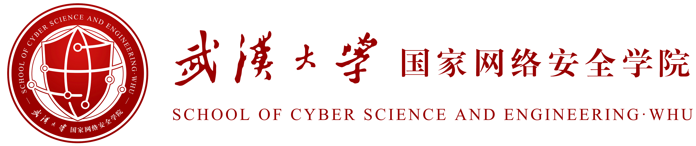

---
# Leave the homepage title empty to use the site title
title:
date: 2022-10-24
type: landing

sections:
  - block: markdown
    content:
     title:
     subtitle: ''
    design:
      columns: '1'
      background:
        image: 
          filename: 2.jpg
          # parallax: false
          position: top
          size: 84%
          # text_color_light: true
      spacing:
        padding: ['40px', '0', '40px', '0']
  #     css_class: fullscreen
  - block: hero
    content:
      <!-- title: |
        Trusted Computing & Security Lab -->
      image: 
        filename: a402_1.jpg

      text: |
        
  <!-- 调整 margin-top 为负值减小间距 -->
          
          
        

        Trusted Computing & Security Lab
        

          
              可信计算与安全实验室
          
        

      
        

        
        
        System Security 
        
        &nbsp;&nbsp;&nbsp;&nbsp;&nbsp;&nbsp;&nbsp;  We are committed to the research of trusted computing represented by <strong>TPM</strong> aiming to build secure and reliable trusted systems. We aim to provide secure foundations for <u>cloud security, big data, blockchain, SDN</u>, and other technologies. In recent years, building on the foundation of trusted computing research, we have expanded our scope to <strong>Confidential Computing</strong> and are dedicated to research in the design and application of trusted execution environment architectures. 
         
         
        
        AI Security 
        
        &nbsp;&nbsp;&nbsp;&nbsp;&nbsp;&nbsp;&nbsp;  We are focused on exploring and developing efficient solutions to address critical issues surrounding <strong>Privacy</strong>. We particularly emphasize the formulation of flexible and robust <u>attack/defense strategies</u> throughout the entire lifecycle of deep learning models, including data collection, model training/inference, and deployment. Additionally, we actively integrate AI technologies with <strong>Traditional Security Domains</strong> such as confidential computing, binary analysis, and vulnerability discovery, aiming to contribute to a wider range of security.
        
        

  
  - block: collection
    content:
      title: Latest News
      subtitle:
      text: 
      count: 20
      #filters:
      #  author: ''
      #  category: ''
      #  exclude_featured: false
      #  publication_type: ''
      #  tag: ''
      offset: 0
      order: desc
      page_type: post
    design:
      view: card
      columns: '1'
  
  # - block: markdown
  #   content:
  #     title:
  #     subtitle: ''
  #     text:
  #   design:
  #     columns: '1'
  #     background:
  #       image: 
  #         filename: coders.jpg
  #         filters:
  #           brightness: 1
  #         parallax: false
  #         position: center
  #         size: cover
  #         text_color_light: true
  #     spacing:
  #       padding: ['20px', '0', '20px', '0']
  #     css_class: fullscreen
  
  # - block: markdown
  #   content:
  #     title:
  #     subtitle:
  #     text: |
  #       {}
  #   design:
  #     columns: '1'
---
