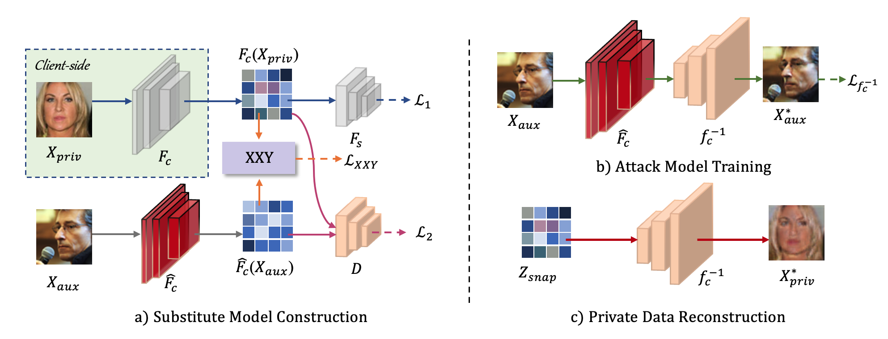

We propose a novel attack, named Feature-Oriented Reconstruction Attack (FORA). As far as we know, FORA is the first work enabling a semi-honest server to perform powerful DRA in more realistic and challenging SL systems.
