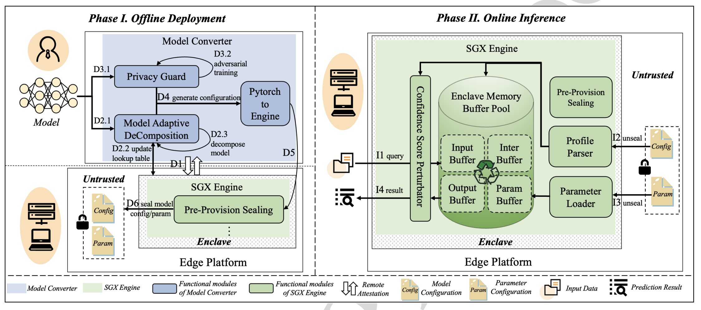

Penetralium is a novel model inference system that we design to provide robust security for deep learning computation at the edge. Penetralium is created with system and algorithm co-design, and has little overhead and no impact on prediction accuracy.
