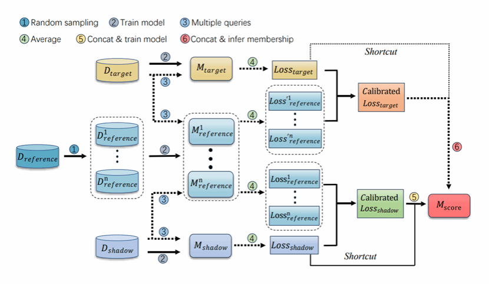

论文题目为“Is Difficulty Calibration All We Need? Towards More Practical Membership Inference Attacks”（《我们只需要困难度校准吗？实现更实用的成员推理攻击》），指导老师为国家网络安全学院王鹃教授（通讯作者），与纽约州立大学布法罗分校Hongxin Hu教授合作完成。国家网络安全学院2020级本科生李勃衡、2020级本科生王尧、和博士生杨梦达参与了该成果的研究工作。

成员推理攻击（Membership Inference Attack）是一种以推导给定数据点是否隶属于目标模型训练集为目标的隐私推断攻击，其既可以用来评估人工智能模型的隐私泄露程度，也可以用来评估模型遗忘（machine unlearning），版权侵犯（Copyright infringement）等。本文重新审视了成员推理攻击中的黄金准则——困难度校正方法，发现其虽然能极大地提高攻击在低假阳性率设置下的表现，但会因”成员分对目标模型的依赖“以及”攻击数据集仅仅为潜分布中采样的有限子集“等原因，导致某些拥有高损失的非成员样本点被错误分类。为了解决这一问题，论文提出直接地复用原始成员分这一有力的非成员信号，即在原始成员分到攻击模型的输入间增加一个残差连接（shortcut）。与已有工作相比，该工作能够在将攻击时间开销降到1/25的条件下，将低假阳率下的真阳率提高到2.5倍。该项研究对人工智能模型隐私保护领域提出了新的挑战。